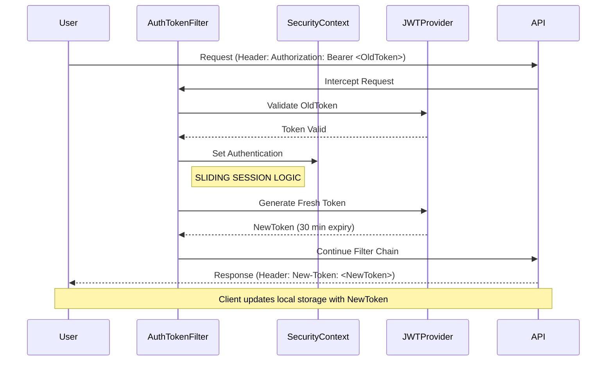
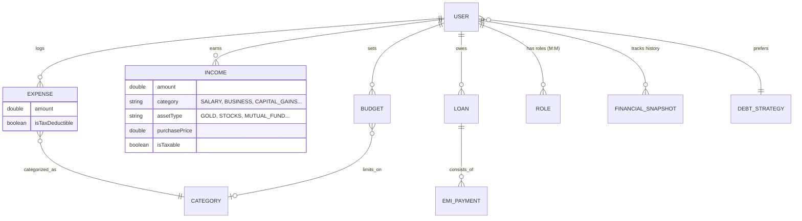
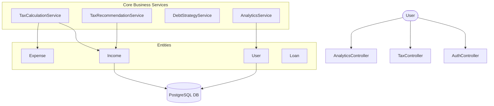

# 💰 SmartExpense Manager – Enterprise Financial Backend

[](https://spring.io/projects/spring-boot)
[](https://www.oracle.com/java/)
[](https://www.postgresql.org/)
[](https://jwt.io/)

SmartExpense Manager is a production-grade financial tracking backend built with **Spring Boot 3**. It offers advanced features like **Indian ITR (1-4) tax calculation**, **Debt Repayment Optimization**, and **Sliding Session Security**, making it a perfect project for demonstrating high-level backend engineering skills.

---

## 🌟 Interview Highlights (Enterprise Features)

-   **Indian Tax Compliance Engine**: Supports **ITR-1 to ITR-4** models with specialized logic for Section 87A rebates and **Presumptive Taxation (8%)**.
-   **Sliding Session Security**: Implemented a **Rolling JWT refresh mechanism** that resets the inactivity timer on every request—balancing security with user experience.
-   **Multi-Regime Tax Comparator**: Real-time comparison between the **Old vs. New Tax Regimes (FY 2025-26)** to recommend the most tax-efficient path.
-   **Intelligent Debt Strategy**: Custom implementations of **Avalanche** (Interest-focused) and **Snowball** (Balance-focused) repayment algorithms.
-   **Automated Data Seeding**: Robust initialization logic that ensures mission-critical database roles exist on startup—zero manual DB setup required for auth.

---

## 🚀 Key Features

### 1. 🛡️ Advanced Security
- **Sliding JWT Sessions**: Tokens are refreshed automatically in the `New-Token` response header.
- **BCrypt Encryption**: Industry-standard hashing for all user credentials.
- **Role-Based Access**: Granular protection (USER/ADMIN) using Spring Security.

### 2. 📊 Indian Tax & ITR Module
- **ITR Forms**: Automated data gathering for ITR-1 (Salary), ITR-2 (Capital Gains), ITR-3 (Professional), and ITR-4 (Presumptive).
- **Asset Classes**: Detailed tracking for **Stocks, Mutual Funds, and Gold** with buy/sell price analysis.
- **FY 2025-26 Ready**: Includes the ₹75,000 standard deduction and ₹12 Lakh rebate rules.

### 3. 📉 Debt & EMI Management
- **Automated EMI Logic**: Paying an EMI automatically reduces loan principal and updates financial snapshots.
- **Strategy Recommendation**: Suggests the best repayment method based on the user's current debt profile.

---

## 📊 System Flow

### Sliding Session Authentication Flow


---

## 💾 Database Schema (ERD)



---

## 🏛 Architecture Diagram



---

## 🚦 New API Endpoints (Tax Module)

| Method | Endpoint | Description |
| :--- | :--- | :--- |
| GET | `/api/tax/recommendation` | Suggests ITR-1, 2, 3, or 4 based on user data |
| GET | `/api/tax/report` | Detailed comparison of Old vs New Tax Regimes |
| POST | `/api/analytics/snapshot` | Save current financial state for historical tracking |

---

## 🛣 Future Roadmap

- [ ] **PDF Report Generator**: Generate professional ITR summary PDFs using iText.
- [ ] **Email Notifications**: Weekly financial health summaries and EMI reminders.
- [ ] **Third-Party Integration**: Real-time stock/gold price syncing for accurate Capital Gains.
- [ ] **Mutual Fund Portfolio Sync**: Integration with CAS (Consolidated Account Statement) files.

---

## ⚙️ Setup & Installation

1.  **Clone & Run**:
    ```bash
    git clone https://github.com/sarangsvkm/smartexpenseapi.git
    ./mvnw spring-boot:run
    ```
2.  **Docker Setup**:
    ```bash
    docker-compose up --build
    ```

---

## 📄 License
This project is licensed under the MIT License - see the [LICENSE](LICENSE) file for details.
