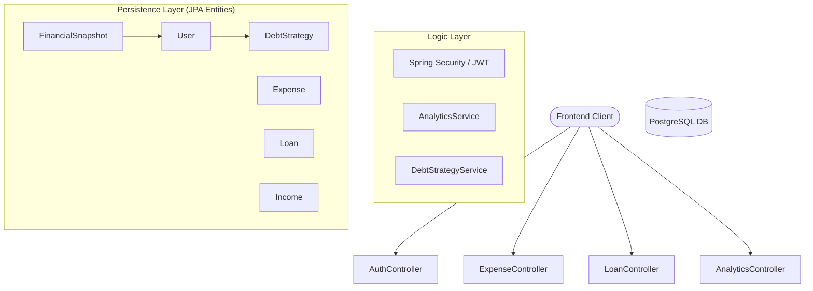
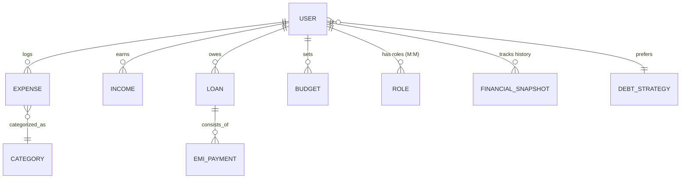

# 💰 SmartExpense Manager – Professional Finance Backend

[](#)
[](https://spring.io/projects/spring-boot)
[](https://www.oracle.com/java/)
[](https://www.postgresql.org/)
[](https://jwt.io/)

SmartExpense Manager is a high-performance, secure financial tracking backend designed for personal wealth management. Built with **Spring Boot 3**, it handles everything from basic expense tracking to complex debt repayment optimization using **Avalanche** and **Snowball** algorithms.

---

## 🌟 Key Highlights (Interview Ready)

-   **Intelligent Debt Strategy**: Implements custom logic to calculate the most efficient way to pay off multiple loans based on user preference (Interest-focused vs. Balance-focused).
-   **Historical Analytics**: Features a **Snapshot Engine** that creates immutable financial records each month for long-term progress tracking.
-   **Stateless Security**: Robust authentication using JWT, following best practices for RESTful service security.
-   **Industry Standard Schema**: A clean, refactored data model that separates logic into dedicated entities (`Income`, `DebtStrategy`, `FinancialSnapshot`).

---

## 🚀 Core Features

### 🔐 Security & Identity
-   **JWT Stateless Auth**: Secure signup/signin with custom `AuthTokenFilter`.
-   **RBAC**: Role-Based Access Control (`User`, `Moderator`, `Admin`).
-   **Encryption**: BCrypt hashing for all sensitive user credentials.

### 💸 Wealth Management
-   **Expense & Budgeting**: Monitor spending against category-specific monthly limits.
-   **Income Streams**: Track multiple revenue sources for accurate savings calculations.
-   **Loan & EMI Tracker**: Automated debt reduction tracking; payoffs are automatically calculated upon EMI confirmation.

### 📊 Financial Intelligence
-   **Strategy Preference**: Switch between **Avalanche** (minimize interest) and **Snowball** (eliminate small debts) with a single toggle.
-   **Health Metrics**: Real-time **Savings Percentage** and **Financial Health Status**.

---

## 🧱 Architecture Overview

### System Architecture


### Database Schema (ERD)


---

## 🚦 API Reference

### 🔑 Authentication
| Endpoint | Method | Description |
| :--- | :--- | :--- |
| `/api/auth/signup` | `POST` | Create a new account |
| `/api/auth/signin` | `POST` | Authenticate & get token |

### 📈 Analytics & Strategies
| Endpoint | Method | Description |
| :--- | :--- | :--- |
| `/api/analytics/summary` | `GET` | Current financial health metrics |
| `/api/analytics/snapshot` | `POST` | Log a monthly progress record |
| `/api/strategies/recommended` | `GET` | Repayment order based on preference |
| `/api/strategies/preference` | `POST` | Toggle Avalanche/Snowball |

---

## 🛠 Tech Stack
-   **Backend**: Spring Boot 3.4.13
-   **Database**: PostgreSQL 15
-   **Security**: Spring Security + JJWT
-   **Documentation**: Mermaid.js, Markdown
-   **Tools**: Lombok, Maven, Jakarta Validation

---

## ⚙️ Quick Start

1.  **Clone the Repo**:
    ```bash
    git clone https://github.com/sarangsvkm/smartexpenseapi.git
    ```
2.  **Configure Database**:
    Add your PostgreSQL credentials to `src/main/resources/application.properties`.
3.  **Run Application**:
    ```bash
    ./mvnw spring-boot:run
    ```

---

## 📄 Repository Meta
- **Author**: Sarang (sarangsvkm)
- **License**: MIT
- **Status**: V2 (Interview Ready)
