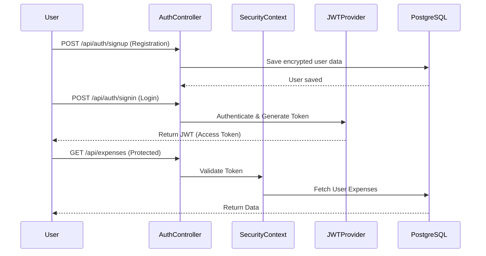
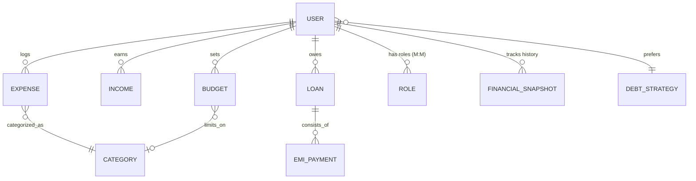
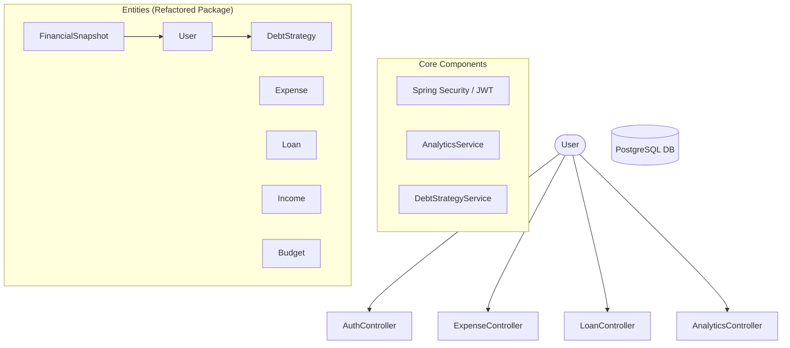

# 💰 SmartExpense Manager – Backend (Spring Boot)

[](https://spring.io/projects/spring-boot)
[](https://www.oracle.com/java/)
[](https://www.postgresql.org/)
[](https://jwt.io/)

SmartExpense Manager is a robust financial tracking backend built with **Spring Boot 3**. It provides a centralized RESTful API to manage user authentication, expenses, income, loans, EMIs, and advanced debt repayment strategies.

---

## 🌟 Interview Highlights (Pro Features)

-   **Intelligent Strategy Engine**: Uses custom algorithms to prioritize debt repayment via **Avalanche** (math/interest-focused) or **Snowball** (behavioral/balance-focused) methods.
-   **Historical Snapshots**: Implemented a specialized entity to store **Monthly Financial Reports**, demonstrating proficiency in time-series data and historical reporting.
-   **Enterprise Schema**: Refactored from a simple model to a normalized **Entity Architecture**, showing adherence to professional backend standards.
-   **Security Excellence**: Stateless JWT authentication with **BCrypt hashing**, ensuring high security and scalability.

---

## 🚀 Key Features

-   **Secure Auth**: JWT-based authentication with Spring Security and BCrypt password encryption.
-   **Expense Tracking**: Categorized spending logs with budget validation.
-   **Income Management**: Track multiple earning sources for accurate savings analysis.
-   **Loan & EMI Engine**: Comprehensive debt tracking with automated balance updates upon EMI payments.
-   **Debt Strategy Engine**: Dynamic repayment optimization using **Avalanche** (highest interest) and **Snowball** (lowest balance) methods.
-   **Financial Analytics**: Real-time health scores, savings percentages, and historical snapshots.

---

## 🛠 Tech Stack

-   **Language**: Java 17
-   **Framework**: Spring Boot 3.x
-   **Security**: Spring Security, JJWT
-   **Database**: PostgreSQL
-   **ORM**: Spring Data JPA / Hibernate
-   **Utilities**: Lombok, Jakarta Validation

---

## 📊 System Flow

### Authentication & Authorization Flow


---

## 💾 Database Schema (ERD)



---

## 🏛 Architecture Diagram



---

## 📂 Project Structure

```text
src/main/java/com/srg/smartexpenseapi/
├── controller/        # REST Endpoints
├── entity/            # Data Models (JPA Entities)
├── repository/        # Data Access Layer
├── service/           # Business Logic
├── security/          # JWT & Security Config
├── payload/           # DTOs (Request/Response)
└── exception/         # Global Error Handling
```

---

## 🚦 API Endpoints (Quick Reference)

### 🔐 Authentication
| Method | Endpoint | Description |
| :--- | :--- | :--- |
| POST | `/api/auth/signup` | Register a new user |
| POST | `/api/auth/signin` | Login & receive JWT |

### 💸 Expenses & Income
| Method | Endpoint | Description |
| :--- | :--- | :--- |
| GET | `/api/expenses` | Get all expenses |
| POST | `/api/income` | Log new income |
| GET | `/api/analytics/summary` | Financial health report |

### 📈 Debt Management
| Method | Endpoint | Description |
| :--- | :--- | :--- |
| GET | `/api/strategies/recommended` | Optimized loan repayment list |
| POST | `/api/strategies/preference` | Save Avalanche/Snowball choice |

---

## ⚙️ Setup & Installation

1.  **Clone the Repository**:
    ```bash
    git clone https://github.com/sarangsvkm/smartexpenseapi.git
    ```

2.  **Database Configuration**:
    Create a PostgreSQL database named `smartexpense_db` and update `src/main/resources/application.properties` with your credentials:
    ```properties
    spring.datasource.url=jdbc:postgresql://localhost:5432/smartexpense_db
    spring.datasource.username=your_username
    spring.datasource.password=your_password
    ```

3.  **Build & Run**:
    ```bash
    ./mvnw spring-boot:run
    ```

---

## 🐳 Docker Deployment

This project is fully containerized for easy deployment.

### Local Setup (Docker Compose)
Run the entire stack (App + PostgreSQL) with a single command:
```bash
docker-compose up --build
```

### Build & Push to Docker Hub
1. **Build the image**:
   ```bash
   docker build -t yourusername/smartexpenseapi:latest .
   ```
2. **Login to Docker Hub**:
   ```bash
   docker login
   ```
3. **Push the image**:
   ```bash
   docker push yourusername/smartexpenseapi:latest
   ```

---

## 🤝 Contributing
Contributions are welcome! Please fork this repository and submit a pull request for any enhancements.

## 📄 License
This project is licensed under the MIT License.
