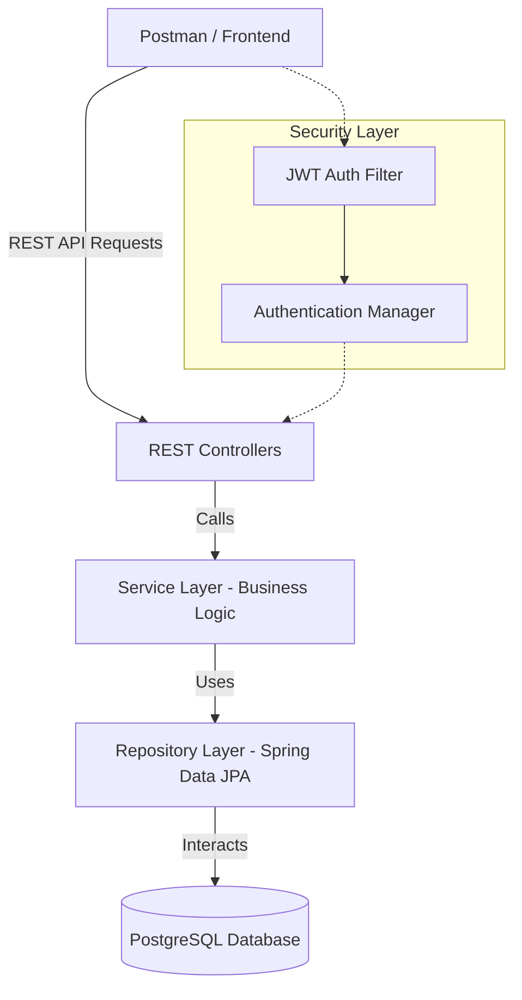

# SmartExpense Manager - Interview Study Guide

This document provides a comprehensive overview of the **SmartExpense Manager** project, covering its architecture, core logic, and technical implementation. Use this to prepare for interviews and explain the "full working principle" of the system.

---

## 1. Project Elevator Pitch
**SmartExpense Manager** is a personal finance management system built using **Spring Boot 3**. Unlike basic expense trackers, it integrates **Smart Debt Payoff Strategies** (Avalanche and Snowball) to help users eliminate debt efficiently. It tracks income, expenses, and budgets, providing real-time financial health analytics and historical snapshots to visualize progress over time.

---

## 2. Tech Stack Deep Dive
- **Backend**: Java 17, Spring Boot 3.5
- **Security**: Spring Security 6.x, JWT (JSON Web Tokens) for stateless authentication.
- **Database**: PostgreSQL (Structured data, strong relational consistency).
- **ORM**: Spring Data JPA (Hibernate) for database interaction.
- **Efficiency**: Lombok (Reduces boilerplate code like Getters/Setters).
- **DevOps**: Docker & Docker Compose (Containerization for consistent deployment).
- **API Testing**: Postman (Detailed collection for testing all endpoints).

---

## 3. System Architecture & Data Flow
The project follows a **Layered Architecture (N-Tier)** to ensure separation of concerns and maintainability.

### Architecture Overview

### Data Flow Example (Adding an Expense):
1.  **Request**: Client sends a POST request with JWT in the Header.
2.  **Filter**: `OncePerRequestFilter` extracts and validates the JWT.
3.  **Security**: User is authenticated and context is set.
4.  **Controller**: `ExpenseController` receives the request body.
5.  **Service**: `ExpenseService` calculates the impact on the budget and updates the logic.
6.  **Repository**: `ExpenseRepository` saves the entity to Postgres via Hibernate.
7.  **Response**: Controller returns the saved Expense object with a 200 OK status.

---

## 4. Core Modules & Working Principles

### A. Authentication & Authorization
- **Working Principle**: Stateless security using JWT.
- **Workflow**:
    1.  User registers (`/signup`) with encrypted password (BCrypt).
    2.  User logs in (`/signin`). Server validates credentials and generates a signed JWT.
    3.  Client stores JWT and sends it in the `Authorization: Bearer <token>` header for subsequent requests.
    4.  Server validates the signature and extracts the `username` to authorize access to resources.

### B. Debt Management (Loans & EMI)
- Users can add Loans (Principal, Interest, Tenure).
- **EMI Tracking**: The system tracks individual EMI payments and updates the `remainingBalance` of the loan automatically.

### C. Smart Payoff Strategies (The "Unique Selling Point")
The `DebtStrategyService` implements two popular financial algorithms:
1.  **Debt Avalanche**:
    *   **Logic**: Sorts loans by **highest interest rate**.
    *   **Principle**: Mathematically superior as it saves the most money on interest over time.
2.  **Debt Snowball**:
    *   **Logic**: Sorts loans by **smallest remaining balance**.
    *   **Principle**: Psychologically superior as it provides "quick wins" by closing small debts first.

### D. Financial Analytics
- **Summary**: Real-time calculation of total savings percentage and financial health (Good/Warning/Critical).
- **Snapshots**: Users can trigger a "Monthly Snapshot" which captures their entire financial state (Income/Expense/Debt) at a specific point in time for historical tracking.

---

## 5. Database Schema Logic
Key entities and their relationships:
- **User (1) <-> (N) Expense/Income/Budget/Loan**: All financial data is user-scoped using `user_id`.
- **Category (1) <-> (N) Expense/Budget**: Centralized category management for consistent labeling.
- **Loan (1) <-> (N) EmiPayment**: Tracks history of payments for a specific debt.

---

## 6. Interview "Pro-Tips"

### Common Technical Questions & Answers

**Q1: Why did you choose JWT instead of Session-based auth?**
> *Answer*: "JWT is stateless and scalable. It allows the backend to be completely decoupled from the frontend and makes it easier to horizontally scale the application since we don't need to share session state across servers."

**Q2: How do you handle database transactions?**
> *Answer*: "I use Spring's `@Transactional` annotation. For example, when adding an EMI payment, the payment record creation and the loan balance update happen within a single transaction to ensure data integrity."

**Q3: How do you handle errors globally?**
> *Answer*: "I implemented a `GlobalExceptionHandler` using `@ControllerAdvice`. It catches specific exceptions (like `MethodArgumentNotValidException`) and returns a standardized JSON error response including a timestamp, message, and description."

**Q4: Explain the Avalanche vs Snowball logic in your code.**
> *Answer*: "In `DebtStrategyService`, I use Java Streams to sort the user's loans. For Avalanche, I sort by `interestRate` in descending order. For Snowball, I sort by `remainingBalance` in ascending order. This gives the user flexibility based on whether they want mathematical efficiency or psychological motivation."

---

## 7. Future Roadmap (What would you add next?)
An interviewer might ask what's missing. You can answer:
1.  **Automated Unit Testing**: Adding JUnit 5 and Mockito for service layer testing.
2.  **External API Integration**: Fetching real-time exchange rates or bank sync.
3.  **Visualization Layer**: Adding Swagger/OpenAPI for interactive documentation.
4.  **CI/CD Pipeline**: Automating builds with GitHub Actions.

---
*Created by Antigravity AI @ 2026-04-12*
